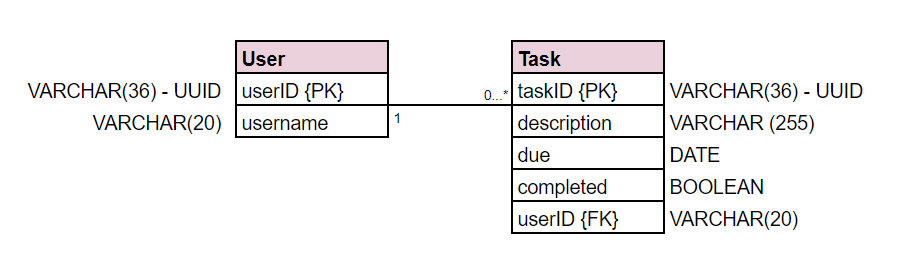

# To-Do List Application - Frontend

This is the backend of my To-Do List application, built during the BBC Step Into Tech course delivered by Tech Returners. It integrates with a frontend, available [here](https://github.com/rosie-i/todo-app-frontend).

<!-- The hosted version of the application is available here: [https://github.com/whatever-link-here](https://github.com/whatever-link-here).-->

### Technology Used

This project uses the following technology:

- Serverless Framework
- JavaScript
- Express
- SQL
- MySQL library
- AWS Lambda and API Gateway
- AWS RDS


### Database Entity Relationship Diagram


### Endpoints

The API exposes the following endpoints:

---

##### GET /tasks

[https://w8wvzvhojl.execute-api.eu-west-2.amazonaws.com/dev/tasks](https://w8wvzvhojl.execute-api.eu-west-2.amazonaws.com/dev/tasks)

Responds with JSON containing all tasks in the Database.

---

##### POST /tasks

[https://w8wvzvhojl.execute-api.eu-west-2.amazonaws.com/dev/tasks](https://0jjep9sqze.execute-api.eu-west-1.amazonaws.com/dev/tasks)

Will create a new task when sent a JSON payload in the format:

```json
{
    "description": "Go to the park",
    "due": "2020-03-19"
}
```

UUID, completed = false and userID = 1 values are assigned in handler.js

---

##### DELETE /tasks/:taskId

[https://w8wvzvhojl.execute-api.eu-west-2.amazonaws.com/dev/tasks/:taskId](https://w8wvzvhojl.execute-api.eu-west-2.amazonaws.com/dev/tasks/:taskId)

Deletes the task of the given taskID.

---

##### PUT /tasks/:taskId

[https://w8wvzvhojl.execute-api.eu-west-2.amazonaws.com/dev/tasks/:taskId](https://w8wvzvhojl.execute-api.eu-west-2.amazonaws.com/dev/tasks/:taskId)

Will update a task when sent a JSON payload in the format:

```json
{
    "taskID":"e8df38ec-486f-11ea-a183-0a3c2504a673",
    "description": "Go to the park",
    "due": "2020-03-19",
    "completed": true,
    "userID":1
}
```